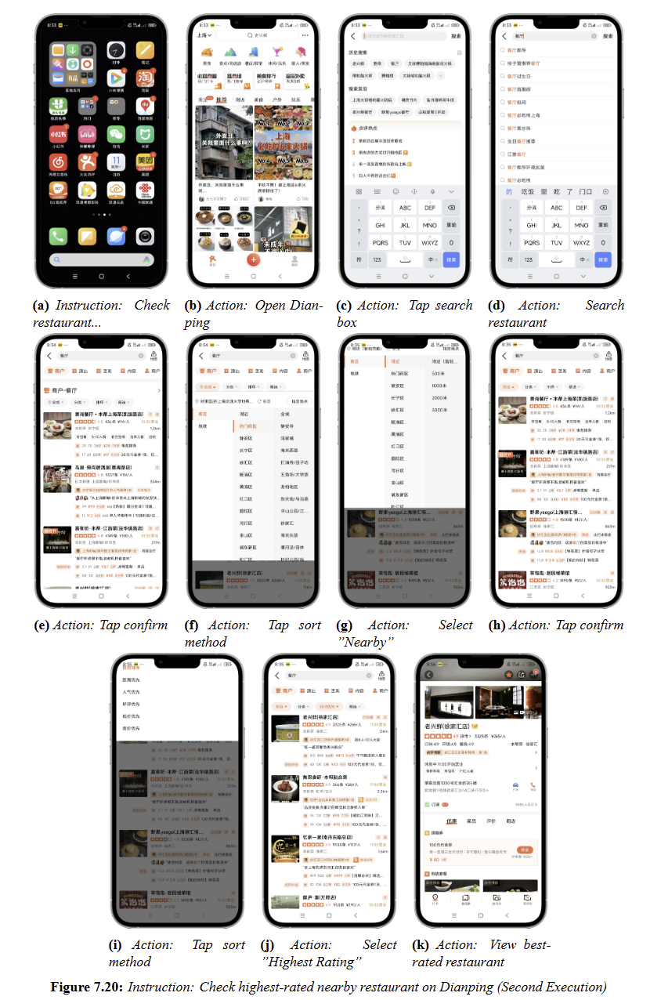
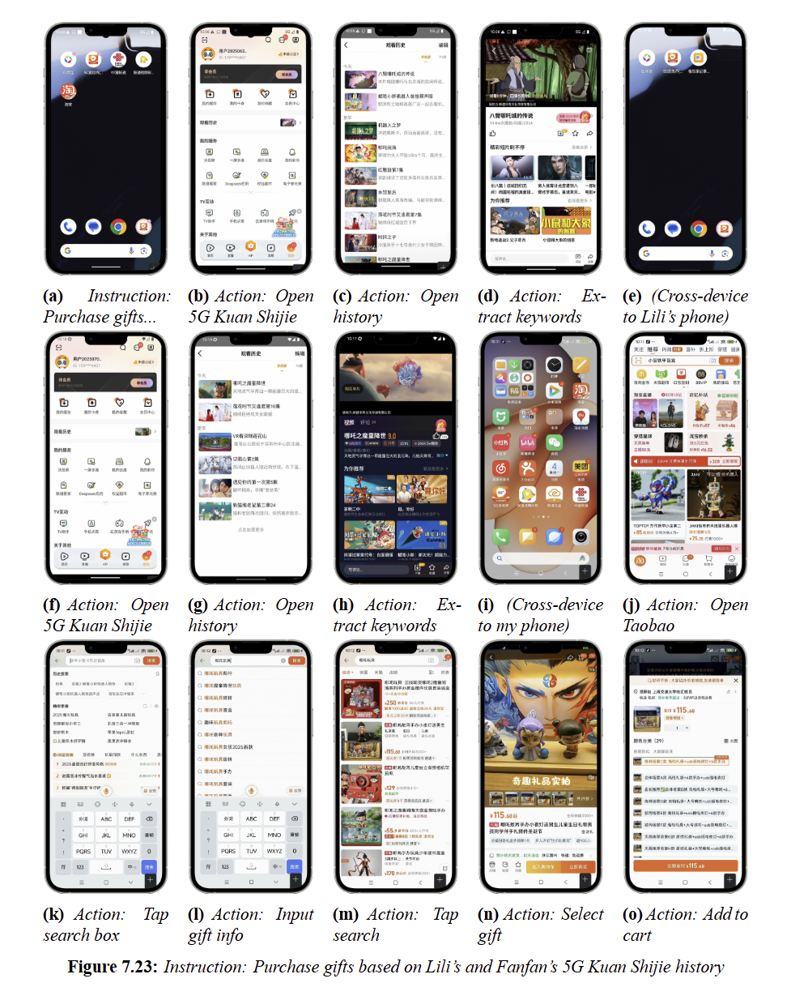

# AppCopilot: Toward General, Accurate, Long‑Horizon, and Efficient Mobile Agent

<p align="center">
    【English | <a href="readme/README_chinese.md">中文</a>】
</p>

<div align="center">
  
</div>

## 📖 Overview

With the rapid evolution of large language models and multimodal foundation models, the mobile-agent landscape has proliferated without converging on the fundamental challenges. This paper identifies four core problems that must be solved for mobile agents to deliver practical, scalable impact: (1) generalization across tasks, modalities, apps, and devices; (2) accuracy, specifically precise on-screen interaction and click targeting; (3) long-horizon capability for sustained, multi-step goals; and (4) efficiency, specifically high-performance runtime on resource-constrained devices.

We present AppCopilot, a multimodal, multi-agent, general-purpose on-device assistant that operates across applications and constitutes a full-stack, closed-loop system from data to deployment. AppCopilot operationalizes this position through an end-to-end autonomous pipeline spanning data collection, training, deployment, high-quality and efficient inference, and PC/mobile application development. At the model layer, it integrates multimodal foundation models with robust Chinese–English support. At the reasoning and control layer, it combines chain-of-thought reasoning, hierarchical task planning and decomposition, and multi-agent collaboration. At the execution layer, it enables user personalization and experiential adaptation, voice interaction, function/tool calling, cross-app and cross-device orchestration, and comprehensive mobile app support. The system design incorporates profiling-driven optimization for latency, memory, and energy across heterogeneous hardware.
Empirically, AppCopilot achieves significant improvements along all four dimensions: stronger generalization, higher-precision on-screen actions, more reliable long-horizon task completion, and faster, more resource-efficient runtime. 

By articulating a cohesive position and a reference architecture that closes the loop from “data collection—training and deployment—high-quality, efficient inference—application development”, this paper offers a concrete roadmap for general-purpose digital assistants and provides actionable guidance for both academic research and industrial adoption.

## 🎉 News

At 2025-8-15, we are excited to announce the release of AppCopilot. AppCopilot is a general-purpose, on-device intelligent assistant that understands text and images, coordinates agents to complete complex tasks, works seamlessly across apps, and supports secure, real-time, cross-device collaboration.

## ⚡️ Quickstart

<details>
<summary>Click to expand</summary>


### AppCopilot Local Run

This section mainly introduces how to connect to the model trained on the server through the API and run AppCopilot locally.

#### Local Environment Basic Requirements

The following table shows the relevant dependency requirements for the local environment:

| **Dependency**  | **Specific Requirements**                                            |
|-----------------|---------------------------------------------------------------------|
| Operating System| An operating system that supports Android Studio                    |
| Software        | Install Android Studio                                              |
| Python Environment| Install Python environment, recommended Python version 3.12        |
| Network         | Disable local VPN to ensure proper connection to the server's vllm API |

##### Install Android Studio

Android Studio is an integrated development environment (IDE) for Android platform development. It can be downloaded from the official [Android Studio website](https://developer.android.com/studio).

#### Server Environment Basic Requirements

The following table introduces the relevant dependency requirements for the server-side environment:

| **Dependency**  | **Specific Requirements**                                            |
|-----------------|---------------------------------------------------------------------|
| Operating System| An operating system that supports Conda and vLLM                    |
| Software        | Install Conda, create a vLLM environment, and install vLLM dependencies|

##### Conda Installation

Conda is an open-source, cross-platform package manager and environment manager that helps users quickly install, run, and manage software packages and their dependencies. You can download it from the official [Conda website](https://anaconda.org/anaconda/conda).

After installing Conda, configure the Python virtual environment with the recommended Python version 3.12:

```bash
conda create --name vllm_env python=3.12
```

##### vLLM Installation

[vLLM](https://docs.vllm.ai/en/latest/) is an open-source high-performance library for large language model inference and services, providing faster responses for generative AI applications at a lower cost and higher efficiency. Here, configure the vLLM-related dependencies and install vLLM version 0.9.1 with the following command:

```bash
pip install vllm==0.9.1
```
##### Other Configuration
To connect to the server API and run AppCopilot, the other configuration requirements for the server environment are as follows:：

```bash
pip install git+https://github.com/huggingface/transformers@f3f6c86582611976e72be054675e2bf0abb5f775
pip install accelerate
pip install qwen-vl-utils
pip install openai
git clone https://huggingface.co/Qwen/Qwen-VL-7B
```

#### Clone the Code
First, clone the folder from the remote repository to the local machine and add the necessary files:

```bash
mkdir AppCopilot
cd AppCopilot
git clone https://github.com/GUIAgents-Dev/GUI-Android.git .
```

To enhance the agent's ability to operate on Android phones, this project also requires the installation of the YADB tool to improve the native ADB functionality. It addresses the limitations of ADB in text input, screenshot capture, and UI layout extraction, providing more efficient and precise operations. Run the following command:

```bash
git clone https://github.com/ysbing/YADB.git ./YADB
```

#### Local System Environment Variable Configuration
##### Configure ADB Environment Variable
1.Windows System ADB Environment Variable Configuration:

On Windows, right-click on This PC, select Properties, and then click Advanced System Settings.

In the pop-up window, click Environment Variables, click New under System variables, enter the variable name: adb, and set the variable value to the directory path where adb is located (e.g., `C:\Android\Sdk\platform-tools`). Then find Path in System variables, and add the previously added ADB environment. Double-click Path, click New, and enter %adb%.

2.macOS/Linux System ADB Environment Variable Configuration:

On Linux or macOS, edit the ~/.bashrc or ~/.bash_profile file and add the ADB path at the end:
```bash
/Users/user/Android/Sdk/platform-tools
```
After saving the file, run `source ~/.bashrc` or `source ~/.bash_profile` to apply the configuration.

After completing the configuration, run `adb version` in the command line. If it correctly outputs the ADB version and related information, the configuration is successful.

##### Configure Emulator Environment Variable
The configuration method is similar to the ADB environment variable configuration.

1.Windows System Emulator Environment Variable Configuration:

On Windows, right-click on This PC, select Properties, and click Advanced System Settings.

In the pop-up window, click Environment Variables, click New under System variables, enter the variable name: emulator, and set the variable value to the directory path where emulator is located (e.g., `C:\Android\Sdk\emulator`). Then find Path in System variables, and add the previously added emulator environment. Double-click Path, click New, and enter %emulator%.

2.macOS/Linux System emulator Environment Variable Configuration:

On Linux or macOS, edit the ~/.bashrc or ~/.bash_profile file and add the emulator path at the end：
```bash
/Users/user/Library/Android/Sdk/emulator
```
After saving the file, run source ~/.bashrc or source ~/.bash_profile to apply the configuration. After completing the configuration, run `emulator version` in the command line. If it correctly outputs the emulator version and related information, the configuration is successful.

#### Configure the Android Device for Running
##### Configure Emulator Environment Variable
This project uses Android Studio to create and manage Android Virtual Devices (AVD). You can refer to the official Android Studio documentation to configure the emulator.

To view the list of available emulators and their names, run the following command:

```bash
emulator -avd <android> -dns-server <Local DNS Server>
```

Where `<android>` is the name of the emulator, and `<Local DNS Server>` is the local DNS address. You only need to specify the DNS Server the first time. After that, you can directly start the emulator with:`emulator -avd <android>`. If a snapshot corruption error occurs during debugging, you can add the `-no-snapshot-load` parameter when starting the emulator.

After completing the above configuration, the Android emulator should run locally, showing an interactive graphical interface, supporting mouse operations, and allowing network access through the host machine's network.

##### Configure Physical Device
In addition to using Android Virtual Devices (AVD), the agent can also control a physical Android phone through ADB. Below are the specific steps to use ADB to control a physical phone:

Enable Developer Mode on Physical Device:

On the phone, go to Settings -> About phone -> All parameters and information, and tap MIUI version 7 times to enable developer mode.

Enable USB Debugging Mode:

In Settings, find Developer options, and enable USB debugging.

Connect Physical Device via ADB:

Connect the phone to the computer via USB, then run adb devices in the command line. If you see the phone's serial number, the connection is successful.

##### Configure Python Environment Dependencies
It is recommended to install and use Python version 3.12. Enter the previously cloned GUI-Android directory and install the following dependencies:
```bash
pip install -r requirements.txt
```

##### Configure Model Keys
In the local code file `./wrappers/constants.py`, users need to manually configure the LLM key for future model calls:
```bash
# ----- model config -----
MODEL_EXTRACT = "Qwen-VL-7B"
ERROR_CALLING_LLM = "Error calling LLM"
MODEL_NOT_FOUND = "LLM not found"

# Replace with actual local endpoint port
END_POINT = "http://localhost:8001/v1/chat/completions"
PORTS = [8002, 8003, 8004]

# Replace with user-provided API key and Base URL
CLIENT_API_KEY = "switch to your own api key"
CLIENT_BASE_URL = "switch to your own base url"
CLIENT = OpenAI(api_key=CLIENT_API_KEY, base_url=CLIENT_BASE_URL)
```

##### Download AppCopilot Model

Download the pre-trained AppCopilot model from https://huggingface.co/ffcosmos/AppCopilot/tree/main and place it on the server to enable the next step of starting the vLLM inference service.

##### Start the vLLM Service on the Server
To enable AppCopilot to call the local large language model remotely, the vLLM inference service must be pre-deployed and started on the server side.

Start the server-side GUI model vLLM service:
```bash
#/your/model/path replace with actual GUI model path
vllm serve /your/model/path \
  --served-model-name AgentCPM-GUI \
  --tensor-parallel-size 1 \
  --trust-remote-code \
  --gpu-memory-utilization 0.9 \
  --limit-mm-per-prompt image=10 \
  --max_model_len 2048 \
  --port 8001
```

Start the server-side Qwen-VL-7B model vLLM service:
```bash
#/your/model/path replace with actual Qwen-VL-7B model path
vllm serve /your/model/path \
  --served-model-name AgentCPM-GUI \
  --tensor-parallel-size 1 \      
  --trust-remote-code \
  --gpu-memory-utilization 0.9 \
  --port 8002 
```

#### Local Run and Start AppCopilot

Before starting the program locally, you should first forward the port 8001 from the remote server to the local port 8001, and forward the port 8002 from the remote server to the local port 8002, to ensure that the local environment can access the model services on the server via the HTTP interface. This port forwarding operation can be executed via the terminal with the following commands:

```bash
ssh -L 8001:localhost:8001 username@model-server-ip
ssh -L 8002:localhost:8002 username@model-server-ip 
```

##### Single-Device Run
Finally, to run AppCopilot on a single device, open the command-line interface in the terminal, navigate to the directory containing the `run_agent.py` file, and run the script with the required parameters. The following is an example command that enables voice input, audio feedback, and runs a custom task:

```bash
# Enable voice input, audio feedback, and run a custom task
python run_agent.py --custom-task 
```

| Parameter                    | Type   | Description                                    |
| ---------------------------- | ------ | ---------------------------------------------- |
| `--predefined-task <TASK_NAME>` | str    | Specify the name of a predefined task (task name must be in the built-in list). |
| `--custom-task`               | flag   | Enable custom task mode, skip predefined task selection. |
| `--enable-experience`         | flag   | Enable experience-based task matching mechanism. |
| `--enable-voice-input`        | flag   | Enable voice input (only valid in custom task mode). |
| `--enable-audio`              | flag   | Enable audio feedback.                        |
| `--show-tasks`                | flag   | Show all available predefined tasks and exit the program. |
| `--enable-vision-parser`      | flag   | Whether to call omniparser for coordinate calibration. |
| `--read-final-page`           | flag   | Whether to enable reading the final page.      |


##### Multi-Device Cross-End Run

For multi-device cross-end scenarios, navigate to the directory containing the cross_device_agent.py file and run the script with the required parameters. The following table shows the available command-line arguments for cross-device running:

| Parameter                  | Type  | Description                                      |
| -------------------------- | ----- | ------------------------------------------------ |
| `--device1-serial`          | str   | ADB serial number for device 1 (optional)        |
| `--device1-port`            | int   | Communication port for device 1 (default 11001). |
| `--device2-serial`          | str   | ADB serial number for device 2 (optional)        |
| `--device2-port`            | int   | Communication port for device 2 (default 11002). |
| `--task`                    | str   | Cross-device task instruction.                   |


### Model Inference Evaluation
#### Data Preparation
##### Android Control

Download [Android Control](https://github.com/google-research/google-research/tree/master/android_control) and save at ``eval/eval_data/tmp/android_control``

```
cd eval/eval_data
python process_ac.py
ln -s android_control_test android_control_high_test
ln -s android_control_test android_control_low_test
```

##### CAGUI

```
cd eval/eval_data
mkdir chinese_app_test && cd chinese_app_test
huggingface-cli download openbmb/CAGUI --repo-type dataset --include "CAGUI_agent/**" --local-dir ./ --local-dir-use-symlinks False --resume-download
mv CAGUI_agent test
```

##### aitz

Download [aitz](https://github.com/IMNearth/CoAT) and save at ``eval/eval_data/tmp/android_in_the_zoo``

```
cd eval/eval_data
mv tmp/android_in_the_zoo ./aitz_test
python process_aitz.py
```

##### gui-odyssey

Download [GUI-Odyssey](https://github.com/OpenGVLab/GUI-Odyssey?tab=readme-ov-file) and save at ``/eval/eval_data/tmp/GUI-Odyssey``. Copy [preprocessing.py](https://github.com/OpenGVLab/GUI-Odyssey/blob/master/data/preprocessing.py) and [format_converter.py](https://github.com/OpenGVLab/GUI-Odyssey/blob/master/data/format_converter.py) from the GUI-Odyssey repo to ``/eval/eval_data/tmp/GUI-Odyssey``

```
cd eval/eval_data/tmp/GUI-Odyssey
python preprocessing.py
python format_converter.py
python ../../process_odyssey.py
```

#### Running Inference
The scripts required for model evaluation are integrated into the `eval_multi.sh` script. Before running, please modify the path parameters in the script based on the actual data storage locations to ensure the correct loading and processing of files.
```bash
# Contents that need to be modified in eval.sh
# Configure basic parameters
data_name="evaluation dataset"
model_name="target model name"
base_output_dir="result directory"

# List of models to process
models_base_path=(
    "models base path"
)
```
Before running model inference evaluation, ensure that the utils folder is correctly configured on the server. After configuring the path parameters correctly, you can execute the following command to start the model inference evaluation process:

```bash
bash eval_multi.sh
```

</details>

## ✨ **Demo Cases**

### Case 1: Single device control


This figure shows the execution using the "search bar filtering" path, demonstrating **active control** over requirement boundaries. The core logic is **precise requirement decomposition**: first search "restaurant" for full coverage, then set "Nearby" distance filter, finally switch to "Highest Rating" sorting. Each step directly corresponds to core instruction conditions.

The task is successfully completed, demonstrating long horizon capabilities in complex application scenarios.

### Case 2: Two-device coordinated control


As shown in this figure, Lili's device stores 5G Kuan Shijie viewing history data, while the user's device completes gift purchasing. This demonstrates **cross-device multi-agent collaboration**, **user preference extraction**, and **cross-application decision-making**.

After authorization verification, the Agent locates the history module and extracts key information from the most recent video. But raw video lists can't directly guide gift selection. Here, the Agent extracts IP keywords from "Crayon Shin-chan" to infer potential interests. This transcends simple data transfer by achieving a leap from data to preference to demand through content understanding.

On the user's device, the Agent receives "Crayon Shin-chan" keywords and launches Taobao. It locates relevant gifts through search, maintaining process coherence across multiple operations.

Critically, the task highlights the core value of cross-device service—breaking device barriers to achieve precise data-to-service docking. Traditional scenarios require manual preference inquiry and product search; the Agent automates the entire process from data collection to product recommendation.

### Case 3: Three-device coordinated control



As shown in this figure, Lili's and Fanfan's devices store viewing history data, while the user's device completes gift purchasing. This extends agent capabilities **from individual users to multi-user collaborative operations**. This isn't simple technical stacking but a paradigm shift from personal assistants to distributed collaboration networks.

Each agent focuses on parsing its own 5G Kuan Shijie history to **extract individual preferences**. The user's agent integrates preference data from both ends to drive targeted gift selection. In this architecture, each agent has independent computational space and decision boundaries, preserving core attributes representing individual intent while breaking limitations through collaboration.

The multi-device task confirms the feasibility of a **distributed intelligence system**. First, addressing reasoning and coordination challenges with incomplete information: Lili's and Fanfan's agents only know their own task status; the user's agent cannot directly access raw data on other devices. Through **data desensitization and intent recognition mechanisms**, agents collaborate accurately despite information gaps.

Second, addressing communication and negotiation mechanisms: agents achieve precise intent transmission through unified protocols despite heterogeneous systems. The successful execution validates that the **mobile agent system has upgraded from single-agent to a system-level architecture with multi-agent collaboration, distributed state modeling, and mechanism design capabilities**. This upgrade's core value enables intelligent services to break single-user boundaries and complete complex cross-domain long-horizon tasks through multiple autonomous agents collaborating—moving toward realizing the "theoretically expandable to massive terminals" vision of collective intelligence.

For more examples, please refer to the original paper.

## 🔎 Citation
```
@article{AppCopilot,
    title = {AppCopilot: Toward General, Accurate, Long‑Horizon, and Efficient Mobile Agent},
    author = {Jingru Fan and Yufan Dang and Jingyao Wu and Huatao Li and Runde Yang and Xiyuan Yang and Yuheng Wang and Chen Qian},
    journal = {arXiv preprint arXiv:2509.02444},
    url = {https://arxiv.org/abs/2509.02444},
    year = {2025}
}
```

## 📬 Contact

If you have any questions, feedback, or would like to get in touch, please feel free to reach out to us via email at [qianc@sjtu.edu.cn](mailto:qianc@sjtu.edu.cn)
