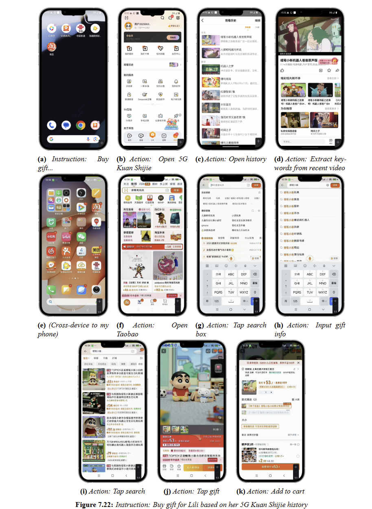

# AppCopilot: Toward General, Accurate, Long‑Horizon, and Efficient Mobile Agent

<p align="center">
    【English | <a href="readme/README-Chinese.md">中文</a>】
</p>

<div align="center">
  
</div>

## 📖 Overview

With the rapid evolution of large language models and multimodal foundation models, the mobile-agent landscape has proliferated without converging on the fundamental challenges. This position paper identifies four core problems that must be solved for mobile agents to deliver practical, scalable impact: (1) generalization across tasks, modalities, apps, and devices; (2) accuracy, specifically precise on-screen interaction and click targeting; (3) long-horizon capability for sustained, multi-step goals; and (4) efficiency, specifically high-performance runtime on resource-constrained devices.

We present AppCopilot, a multimodal, multi-agent, general-purpose on-device assistant that operates across applications and constitutes a full-stack, closed-loop system from data to deployment. AppCopilot operationalizes this position through an end-to-end autonomous pipeline spanning data collection, training, deployment, high-quality and efficient inference, and PC/mobile application development. At the model layer, it integrates multimodal foundation models with robust Chinese–English support. At the reasoning and control layer, it combines chain-of-thought reasoning, hierarchical task planning and decomposition, and multi-agent collaboration. At the execution layer, it enables user personalization and experiential adaptation, voice interaction, function/tool calling, cross-app and cross-device orchestration, and comprehensive mobile app support. The system design incorporates profiling-driven optimization for latency, memory, and energy across heterogeneous hardware.
Empirically, AppCopilot achieves significant improvements along all four dimensions: stronger generalization, higher-precision on-screen actions, more reliable long-horizon task completion, and faster, more resource-efficient runtime. 

By articulating a cohesive position and a reference architecture that closes the loop from “data collection—training and deployment—high-quality, efficient inference—application development”, this paper offers a concrete roadmap for general-purpose digital assistants and provides actionable guidance for both academic research and industrial adoption.

## 🎉 News

At 2025-8-15, we are excited to announce the release of AppCopilot. AppCopilot is a general-purpose, on-device intelligent assistant that understands text and images, coordinates agents to complete complex tasks, works seamlessly across apps, and supports secure, real-time, cross-device collaboration.

## ⚡️ Quickstart

<details>
<summary>Click to expand</summary>


### AppCopilot Local Execution

This section mainly describes how to connect to a pre-trained model deployed on the server via API and run AppCopilot locally.

#### Local Environment Basic Requirements

Table 1 shows the relevant dependency requirements for the local environment.

| **Dependency** | **Specific Requirement** |
| -------------- | ------------------------ |
| Operating System | OS that supports Android Studio |
| Software | Install Android Studio |
| Python Environment | Install Python (recommended version: 3.12) |
| Network | Disable local VPN, ensure the server-side vLLM API can be connected properly |

##### Install Android Studio
Android Studio is an integrated development environment for the Android platform. You can download it from its [official website](https://developer.android.com/studio).

---

#### Server Environment Basic Requirements

Table 2 shows the relevant dependency requirements for the server environment.

| **Dependency** | **Specific Requirement** |
| -------------- | ------------------------ |
| Operating System | OS that supports Conda and vLLM |
| Software | Install Conda, create vLLM environment, and install vLLM dependencies |

##### Install Conda
Conda is an open-source, cross-platform package and environment manager for quickly installing, running, and managing multi-language software packages and their dependencies. Download from its [official website](https://anaconda.org/anaconda/conda).  

After installing Conda, configure a Python virtual environment (recommended version: 3.10):
```bash
conda create --name vllm_env python=3.10
```

##### Install vLLM
[vLLM Documentation](https://docs.vllm.ai/en/latest/) — vLLM is an open-source, high-performance framework and engine for LLM inference and serving. It enables faster responses for generative AI applications while reducing cost and improving efficiency. Install version 0.9.1 as follows:

```bash
pip install vllm==0.9.1
```

##### Other Configurations
To enable AppCopilot to connect to the server via API, configure the remaining server environment dependencies as follows:
```bash
pip install git+https://github.com/huggingface/transformers@f3f6c86582611976e72be054675e2bf0abb5f775
pip install accelerate
pip install qwen-vl-utils
pip install openai
git clone https://huggingface.co/Qwen/Qwen-VL-7B
```

---

#### Clone the Code

First, clone the repository to the local machine and add the relevant files:
```bash
mkdir AppCopilot
cd AppCopilot
git clone https://github.com/GUIAgents-Dev/GUI-Android.git .
```

To improve the agent's ability to operate on Android devices, install YADB (Yet Another Debug Bridge) to enhance native ADB (Android Debug Bridge) functionality. YADB overcomes limitations of ADB in text input, screenshot capture, and UI layout extraction, providing more efficient and precise operations.

In the current directory, execute:
```bash
git clone https://github.com/ysbing/YADB.git ./YADB
```

---

#### Configure Local System Environment Variables

##### Configure `adb` Environment Variable

1. **Windows**:  
   - Right-click **This PC**, choose **Properties**, click **Advanced system settings**, and then click **Environment Variables**.  
   - In **System Variables**, click **New**, enter variable name `adb` and set the variable value to the directory path where adb is located (e.g., `C:\Android\Sdk\platform-tools`).  
   - Then in the **System Variables** list, find `Path`, click **Edit**, **New**, and enter `%adb%`.

2. **macOS/Linux**:  
   - Edit `~/.bashrc` or `~/.bash_profile` and add the adb path at the end of the file:
     ```bash
     /Users/user/Android/Sdk/platform-tools
     ```
   - Save and run `source ~/.bashrc` or `source ~/.bash_profile` to apply changes.

After configuration, run:
```bash
adb version
```
If adb version info is printed, the configuration is successful.

##### Configure `emulator` Environment Variable

Configuration is similar to adb:

1. **Windows**:  
   
   - Same as adb, but set variable name `emulator` and value to emulator directory (e.g., `C:\Android\Sdk\emulator`).  
   - Add `%emulator%` to `Path`.
   
2. **macOS/Linux**:  
   - Edit `~/.bashrc` or `~/.bash_profile` and add:
     ```bash
     /Users/user/Library/Android/Sdk/emulator
     ```
   - Save and run `source ~/.bashrc` or `source ~/.bash_profile`.

Check with:
```bash
emulator version
```

---

#### Configure Android Devices

##### Configure Emulator

We use Android Studio to create and manage Android Virtual Devices (AVD). See [official docs](https://developer.android.com/studio/run/managing-avds).

1. **List emulator names**:
```bash
emulator -list-avds
```
2. **Configure emulator network**:
```bash
emulator -avd <android> -dns-server <Local DNS Server>
```
Replace `<android>` with emulator name and `<Local DNS Server>` with your DNS. First time specify DNS, later can simply:
```bash
emulator -avd <android>
```
If snapshot errors occur, add `-no-snapshot-load`.

After completing the above configuration, the Android emulator should run locally with an interactive GUI, support mouse operations, and access the internet via host network sharing. The following figure shows the project page after launching the Android virtual machine.


##### Configure Physical Device

Besides AVD, the agent can operate a physical Android phone via adb. Example with **Xiaomi MIUI 14.0.11**:

1. Enable Developer Mode: Settings → My Device → All Specs → Tap MIUI Version 7 times.
2. Enable USB Debugging: Settings → Developer Options → USB Debugging.
3. Connect phone via USB, then run:
```bash
adb devices
```
If your device serial appears, adb connection is ready.

---

#### Configure Python Dependencies
Recommended Python 3.12. Navigate to the previously cloned `GUI-Android` directory on your local machine, and install the following dependencies:
```bash
pip install -r requirements.txt
```

#### Configure Model API Keys
Edit `./wrappers/constants.py`:


```python
# ----- model config -----
MODEL_EXTRACT = "deepseek-v3-250324"
ERROR_CALLING_LLM = "Error calling LLM"
MODEL_NOT_FOUND = "LLM not found"

# Modify to the actual local listening port
END_POINT = "http://localhost:8001/v1/chat/completions"
PORTS = [8002, 8003, 8004]

# Replace with your own API key and Base URL
CLIENT_API_KEY = "switch to your own api key"
CLIENT_BASE_URL = "switch to your own base url"
CLIENT = OpenAI(api_key=CLIENT_API_KEY, base_url=CLIENT_BASE_URL)
```

---

#### Start Server-side vLLM Services

To enable remote invocation of the server-hosted LLM from the locally running AppCopilot, you must pre-deploy and start the vLLM inference service on the server. The service exposes model access via an HTTP API. Start it from the command line, setting the model path to the directory of your trained checkpoint. Launch vLLM for both the trained GUI model and the downloaded Qwen-VL-7B model, binding them to ports **8001** and **8002**, respectively.

**GUI model service**:

```bash
# Replace `/your/model/path` with the actual path to your GUI model.
vllm serve /your/model/path   
--served-model-name AgentCPM-GUI \
--tensor_parallel_size 1 \  
--trust-remote-code \  
--gpu-memory-utilization 0.9 \  
--limit-mm-per-prompt image=10 \  
--max_model_len 2048 \  
--port 8001
```

**Qwen-VL-7B model service**:

```bash
# Replace `/your/model/path` with the actual path to your Qwen-VL-7B model.
vllm serve /your/model/path  
--served-model-name AgentCPM-GUI   
--tensor-parallel-size 1   
--trust-remote-code   
--gpu-memory-utilization 0.9   
--port 8002
```

---

#### Run AppCopilot Locally

Before starting the program locally, you should first forward port **8001** from the remote server to local port **8001**, and forward port **8002** from the remote server to local port **8002**. This ensures that the local environment can access the server-side model services via HTTP API. Port forwarding can be performed by executing the corresponding commands in the local terminal.

```bash
ssh -L 8001:localhost:8001 username@model-server-ip
ssh -L 8002:localhost:8002 username@model-server-ip
```

---

#### Single-Device Mode

To run AppCopilot on a single device, open a terminal on your local machine, navigate to the directory containing `run_agent.py`, and execute the script with the desired arguments according to the parameter reference table below. 
The example below enables voice input and audio feedback, and runs a custom task:

```bash
# Enable voice input and audio feedback, and run a custom task
python run_agent.py --custom-task --enable-voice-input --enable-audio
```

##### Command-Line Parameters for run_agent.py

| Parameter                       | Type | Description                                                  |
| ------------------------------- | ---- | ------------------------------------------------------------ |
| `--predefined-task <TASK_NAME>` | str  | Specify the name of a predefined task (must be in the built-in list). |
| `--custom-task`                 | flag | Enable custom task mode, skipping predefined task selection. |
| `--enable-experience`           | flag | Enable experience-based task matching mechanism.             |
| `--enable-voice-input`          | flag | Enable voice input (only effective in custom task mode).     |
| `--enable-audio`                | flag | Enable audio feedback.                                       |
| `--show-tasks`                  | flag | Display all available predefined tasks and exit.             |
| `--enable-vision-parser`        | flag | Use `omniparser` for coordinate calibration.                 |
| `--read-final-page`             | flag | Enable reading aloud of the final interface.                 |

---

#### Multi-Device Mode

To run AppCopilot across multiple devices, navigate to the directory containing `cross_device_agent.py` and execute it with the appropriate arguments according to the table below.

##### Command-Line Parameters for cross_device_agent.py

| Parameter          | Type | Description                                      |
| ------------------ | ---- | ------------------------------------------------ |
| `--device1-serial` | str  | ADB serial number of device 1 (optional).        |
| `--device1-port`   | int  | Communication port of device 1 (default: 11001). |
| `--device2-serial` | str  | ADB serial number of device 2 (optional).        |
| `--device2-port`   | int  | Communication port of device 2 (default: 11002). |
| `--task`           | str  | Cross-device task command.                       |

### Model Post-training on the Server

This section introduces the complete workflow for reproducing model post-training on the server, including **data preprocessing**, **Supervised Fine-Tuning (SFT)**, **Reinforcement Fine-Tuning (RFT)**, and **model inference evaluation** after post-training.

---

#### Data Preprocessing

Before post-training the model, we first preprocess the collected GUI interaction data. 

The data processing workflow consists of three main steps:

1. **Data cleaning** – remove low-quality samples.
2. **Data format standardization** – convert valid data into a unified structured format.
3. **Data augmentation** – expand dataset size to improve model generalization.

##### Data Cleaning

The cleaning process is handled by the provided `clear.py` script, which only depends on Python standard libraries.  

Before running, modify the path parameters in the main function according to your dataset location:

```python
if __name__ == "__main__":
    main_folder = "/your/path1"  # Path to data to clean
    tmp_folder = "/your/path2"   # Store samples with duplicate 'instruction' fields
    tmp_step_folder = "/your/path3"  # Store samples with invalid path length
```

Run:

```bash
python clear.py
```

##### Data Format Standardization

Run the provided `data.py` script after modifying path parameters:

```python
def main():
    source_base = "/your/path1"      # Input raw data directory
    destination_base = "/your/path2" # Output standardized data directory
```

Run:

```bash
python data.py
```

##### Data Augmentation

Run `data_process_ins.py` after modifying model and path parameters:

```python
client = OpenAI(
  api_key='your_api_key',
  base_url='your_base_url'
)
model_name = "your_model"

source_base = "/your/path1"      # Input directory
destination_base = "/your/path2" # Output directory
```

Run:

```bash
python data_process_ins.py
```

---

#### Supervised Fine-Tuning (SFT)

##### Environment Setup

All SFT-related scripts are integrated in `finetune_ds.sh`.  
Enter the SFT directory and set up the environment:

```bash
conda create -n gui-sft python=3.10
conda activate gui-sft
# Comment out flash-attn in requirements.txt before installing
pip install -r requirements.txt
pip install flash_attn==2.7.4.post1 -i https://pypi.tuna.tsinghua.edu.cn/simple --no-build-isolation
```

##### Running SFT

Modify `finetune_ds.sh` paths before running:

```bash
MODEL="/path/to/your/model"
DATA="/your/path/to/data"
EVAL_DATA="/your/path/to/eval_data"
LLM_TYPE="qwen" # Change depending on model
```

Run:

```bash
bash finetune_ds.sh
```

---

#### Reinforcement Fine-Tuning (RFT)

##### Environment Setup

All RFT-related scripts are in `fsdp.sh`. 
Enter the RFT directory and set up the environment:

```bash
conda create -n fjr-arl python=3.11
conda activate fjr-arl

# Install dependencies (comment out flash_attn, torch, transformers in requirements.txt before install)
pip install -r requirements.txt
pip install flash_attn==2.7.4.post1 -i https://pypi.tuna.tsinghua.edu.cn/simple --no-build-isolation
pip install torch==2.6.0 torchvision==0.21.0 torchaudio==2.6.0 --index-url https://download.pytorch.org/whl/cu124
pip install transformers==4.51.0
```

##### Running RFT

Modify `fsdp.sh` before running:

```bash
source /opt/miniconda3/bin/activate fjr-arl
--model_name_or_path /path/to/your/model
--dataset_name /path/to/your/dataset
--eval_dataset_name /path/to/your/eval_dataset
```

Before running the RFT process, make sure that the `trainer/utils` folder and `trainer/arl.py` in the server environment are properly configured, and that they are at the same directory level as `fsdp.sh` and `grpo.py`.
If the paths are not set correctly, the program will fail to load the required modules and will not run.
Once the path parameters are correctly set, you can execute the corresponding command in the terminal to start the RFT process.

Run:

```bash
bash fsdp.sh
```

---

#### Model Inference Evaluation

The evaluation process is in `eval.sh`.  
Modify paths before running:

```bash
model_base_path="/path/to/your/model"
data_name="/path/to/your/data"
model_name="your_model_name"
base_output_dir="/path/to/your/output"
```

Before running the model inference evaluation, make sure that the `utils` folder in the server environment is properly configured and is located at the same directory level as `eval.sh`, `run_predict_minicpm.py`, and `run_eval_agent.py`.
If the paths are not set correctly, the program will fail to load the required modules and will not run.
Once the path parameters are correctly set, you can execute the corresponding command in the terminal to start the model inference evaluation process.

Run:

```bash
bash eval.sh
```

---

### Resource Summary

The project includes clear, well-structured scripts and configuration files for **data processing**, **post-training**, and **evaluation**, ensuring reproducibility.

#### Data Processing Scripts

| File                   | Type   | Description                            |
| ---------------------- | ------ | -------------------------------------- |
| `clear.py`             | Python | Cleans raw data                        |
| `data.py`              | Python | Converts raw data to structured format |
| `data_process_ins.py`  | Python | Instruction text augmentation          |
| `data_process_bbox.py` | Python | Bounding box augmentation              |

**Dataset Sizes**:

| Stage                     | Size |
| ------------------------- | ---- |
| GUI Grounding Pretraining | 12M  |
| SFT                       | 6M   |

#### Post-Training Scripts

| File             | Type   | Description              |
| ---------------- | ------ | ------------------------ |
| `finetune_ds.sh` | Shell  | SFT command script       |
| `finetune.py`    | Python | Main SFT program         |
| `dataset.py`     | Python | Dataset builder          |
| `trainer.py`     | Python | Trainer builder          |
| `fsdp.sh`        | Shell  | RFT command script       |
| `trainer/utils`  | Folder | Called by `grpo.py`      |
| `fsdp2_dst.yml`  | YAML   | Distributed RFT config   |
| `grpo.py`        | Python | Distributed RFT training |
| `trainer/arl.py` | Python | Called by `grpo.py`      |
| `configs.py`     | Python | Called by `grpo.py`      |

#### Evaluation Scripts

| File                     | Type   | Description                      |
| ------------------------ | ------ | -------------------------------- |
| `eval.sh`                | Shell  | Automated inference & evaluation |
| `run_predict_minicpm.py` | Python | Model inference                  |
| `run_eval_agent.py`      | Python | Automated evaluation             |
| `utils`                  | Folder | Called by `run_eval_agent.py`    |

</details>

## ✨ **Demo Cases**

### Case 1: Single device control


Fig shows the execution using the "search bar filtering" path, demonstrating **active control** over requirement boundaries. The core logic is **precise requirement decomposition**: first search "restaurant" for full coverage, then set "Nearby" distance filter, finally switch to "Highest Rating" sorting. Each step directly corresponds to core instruction conditions.

The task is successfully completed, demonstrating long horizon capabilities in complex application scenarios.

### Case 2: Two-device coordinated control


As shown in Fig, Lili's device stores 5G Kuan Shijie viewing history data, while the user's device completes gift purchasing. This demonstrates **cross-device multi-agent collaboration**, **user preference extraction**, and **cross-application decision-making**.

After authorization verification, the Agent locates the history module and extracts key information from the most recent video. But raw video lists can't directly guide gift selection. Here, the Agent extracts IP keywords from "Crayon Shin-chan" to infer potential interests. This transcends simple data transfer by achieving a leap from data to preference to demand through content understanding.

On the user's device, the Agent receives "Crayon Shin-chan" keywords and launches Taobao. It locates relevant gifts through search, maintaining process coherence across multiple operations.

Critically, the task highlights the core value of cross-device service—breaking device barriers to achieve precise data-to-service docking. Traditional scenarios require manual preference inquiry and product search; the Agent automates the entire process from data collection to product recommendation.

### Case 3: Three-device coordinated control


As shown in Fig, Lili's and Fanfan's devices store viewing history data, while the user's device completes gift purchasing. This extends agent capabilities **from individual users to multi-user collaborative operations**. This isn't simple technical stacking but a paradigm shift from personal assistants to distributed collaboration networks.

Each agent focuses on parsing its own 5G Kuan Shijie history to **extract individual preferences**. The user's agent integrates preference data from both ends to drive targeted gift selection. In this architecture, each agent has independent computational space and decision boundaries, preserving core attributes representing individual intent while breaking limitations through collaboration.

The multi-device task confirms the feasibility of a **distributed intelligence system**. First, addressing reasoning and coordination challenges with incomplete information: Lili's and Fanfan's agents only know their own task status; the user's agent cannot directly access raw data on other devices. Through **data desensitization and intent recognition mechanisms**, agents collaborate accurately despite information gaps.

Second, addressing communication and negotiation mechanisms: agents achieve precise intent transmission through unified protocols despite heterogeneous systems. The successful execution validates that the **mobile agent system has upgraded from single-agent to a system-level architecture with multi-agent collaboration, distributed state modeling, and mechanism design capabilities**. This upgrade's core value enables intelligent services to break single-user boundaries and complete complex cross-domain long-horizon tasks through multiple autonomous agents collaborating—moving toward realizing the "theoretically expandable to massive terminals" vision of collective intelligence.

## 🔎 Citation
```
@article{AppCopilot,
    title = {AppCopilot: Toward General, Accurate, Long‑Horizon, and Efficient Mobile Agent},
    author = {Jingru Fan and Yufan Dang and Jingyao Wu and Huatao Li and Runde Yang and Xiyuan Yang and Yuheng Wang and Zhong Zhang and Yaxi Lu and Yankai Lin and Zhiyuan Liu and Dahai Li and Chen Qian},
    journal = {arXiv preprint arXiv:******},
    url = {https://arxiv.org/abs/******},
    year = {2025}
}
```

## 📬 Contact

If you have any questions, feedback, or would like to get in touch, please feel free to reach out to us via email at [qianc@sjtu.edu.cn](mailto:qianc@sjtu.edu.cn)
